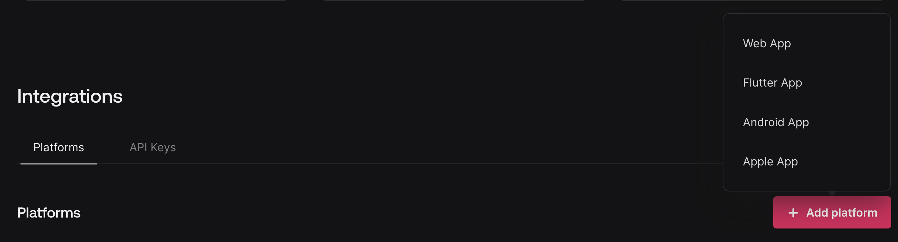
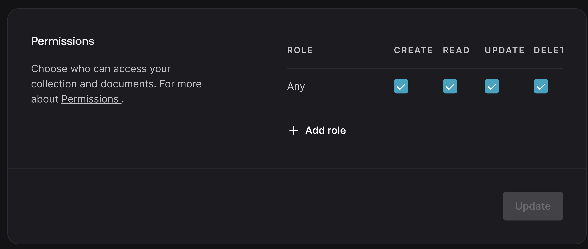

# Sticky Notes App

Drag and drop sticky notes app built with vanilla Javascript (frontend) and Appwrite (backend)


  

## App Features

  - Drag & Drop notes
  - Save note position
  - Change note colors
  - Full Create Read Update & Delete functionality with backend
  - Auto save (Changes to notes saved automatically)
  - Auto expand on keyups (Note get's larger as text content gets added)
  - Drag off out of frame

  ## Setup & run locally - Instructions

 **1 - Clone repo & Install packages**

 - `git clone <repo endpoint>`
 - `cd stickynotes`
 - `npm run install`
 
 **2 - Setup Appwrite backend**

 Create a new project on `cloud.appwrite.io`.

 Create a new app within your appwrite project:

 This is done by clicking the "Add a platform" button and selecting "Web App"

  
   
Create a new Database, and a new collection. Collection should be named "notes".

Add the following attributes to your collection:

- `body` - Type:String | Max Char | 1000
- `colors` - Type:String | Max Char | 1000
- `position` - Type:String | Max Char | 1000


Set collection permissions under the `settings` tab. For testing purposes you can set permissions to `any`.

  


 **3 - Add app credentials to .env file**

Create.env file (see `.env.example`).

Add credentials from Appwrite app

 ```
VITE_ENDPOINT=
VITE_PROJECT_ID=
VITE_DATABASE_ID=
VITE_COLLECTION_NOTES_ID=
 ```

**4 - Run Server**

`npm run dev`